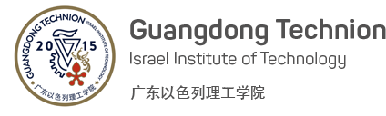

# **这里是 GTIIT 的一个小小资源库**

## **目录指引**
- [**这里是 GTIIT 的一个小小资源库**](#这里是-gtiit-的一个小小资源库)
  - [**目录指引**](#目录指引)
  - [**项目介绍**](#项目介绍)
  - [**内容简介**](#内容简介)
  - [**相关指南**](#相关指南)

## **项目介绍**
- 朋友们好，我是广东以色列理工学院（GTIIT）19级 材料专业的一名学生。目前学校才刚刚起步，各类基础设施建设及网上资源还在逐步完善。近期有许多同学苦恼于Python作业，同时学校也新开增了CS专业，于是想构建这么一个Repository来存放计算机有关的资源，也算是为未来学校网络建设贡献出微薄之力😛

## **内容简介**
- 以语言为区别指标
> **[Python](/Python)**
  
> **[C++](/C++)**

> **以后还会增加更多语言（如果有人愿意做的话）** 

 **不单单是编程作业，一起与编程相关的资料都可能上传，还请folk的朋友们做好分类🙏**

 ## **相关指南**

- [GTIIT官网](https://www.gtiit.edu.cn/)